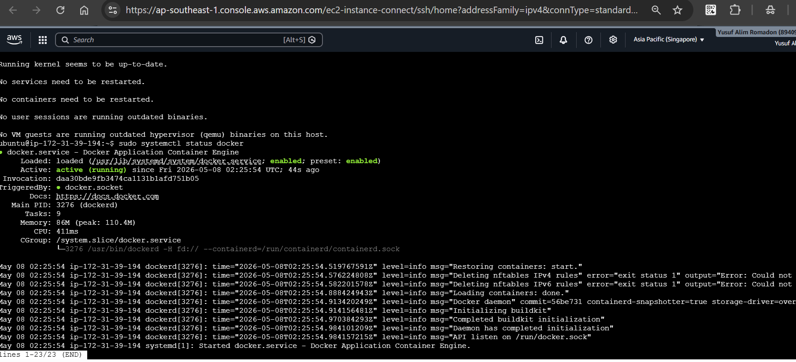
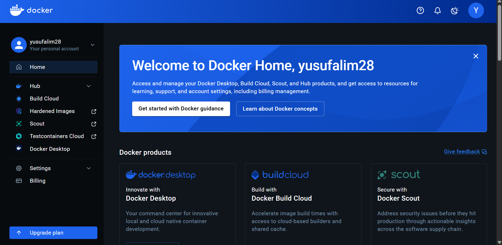
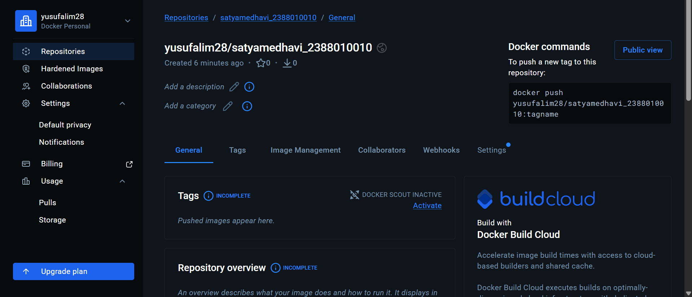
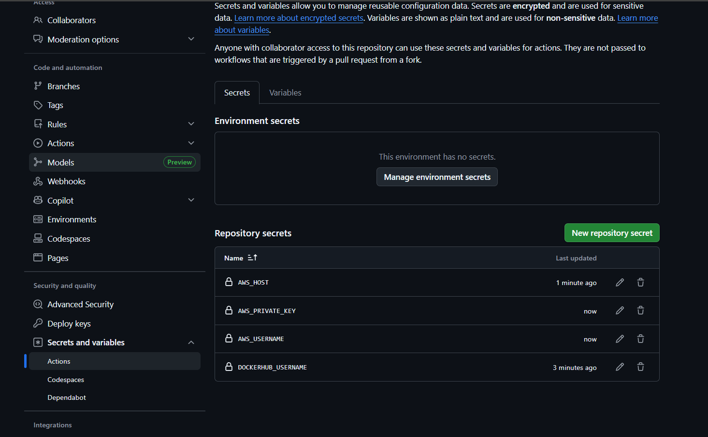
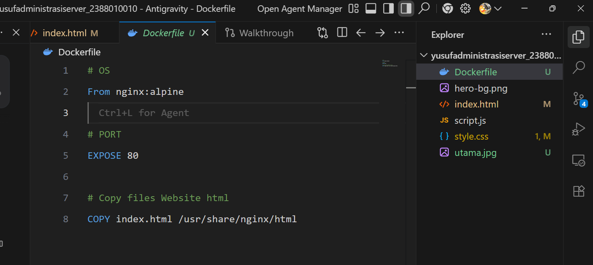
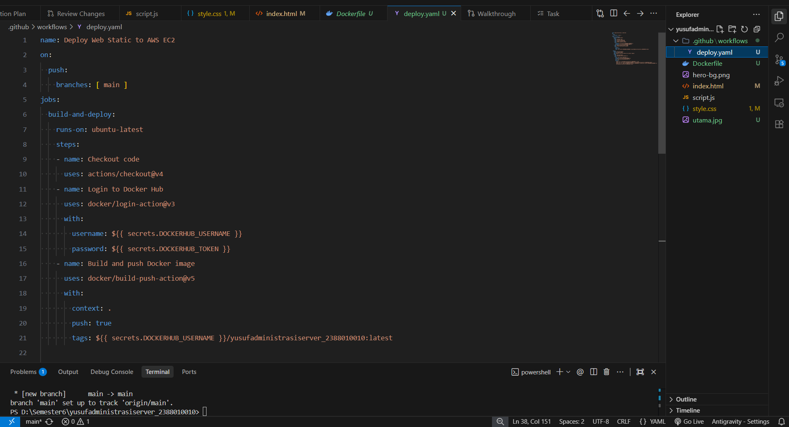

## CI/CD dengan Git -> Github Action -> Docker hub -> EC2 AWS
## Langkah 1
1. Start Instance di AWS EC2
2. Connect -> ubuntu -> connect
3. patching OS -> Sudo apt update && sudo apt upgrade
4. Install Docker di EC2 AWS https://docs.docker.com/ -> https://docs.docker.com/engine/install/ 
5. Uninstall old versions -> sudo apt remove $(dpkg --get-selections docker.io docker-compose docker-compose-v2 docker-doc podman-docker containerd runc | cut -f1)
6. ikutin cara install dari doc docer di atas sampai install selesai
7. sudo systemctl status docker

  ## Langkah 2 Docker Hub
1. https://hub.docker.com/ -> sign 

2. di sidebar Hub -> Create repo -> masukin nama "yusuf_2388010010" 
3. create tokens klik profil -> account setting -> personal accsess tokens -> Generate tokens -> sampai selesai

## langkah 3 masuk ke github
1. buat repo baru "yusufadministrasiserver_2388010010"
2. bikin commpany Profile "antigravity"
3. koneksikan ke github
4. masuk github -> setting -> secrets and variabeles -> action -> New secret -> masukan name "DOCKERHUB_USERNAME", secretnya: "masukan name sesuai dengan nama docker username"
5. bikin lagi AWS_HOST, secretnya "ip dari EC2"
6. bikin lagi AWS_Private_key, secretnya "namakey.pem"
7. bikin lagi AWS_USERNAME, secretnya "ubuntu"

## Membuat Resep Lingkungan Pengembangan (Dockerfile)
- Buat File Dockerfile di root repo
- 

sudo usermod -aG docker ubuntu