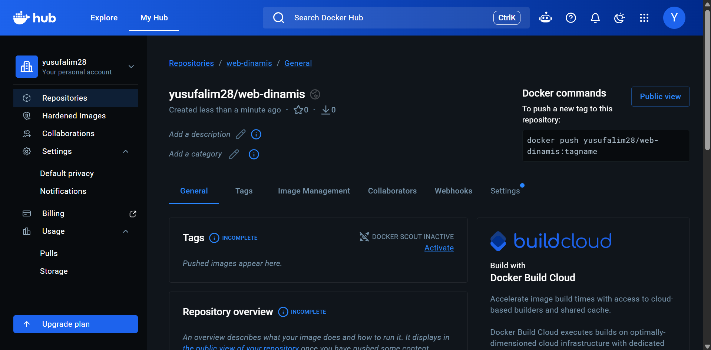
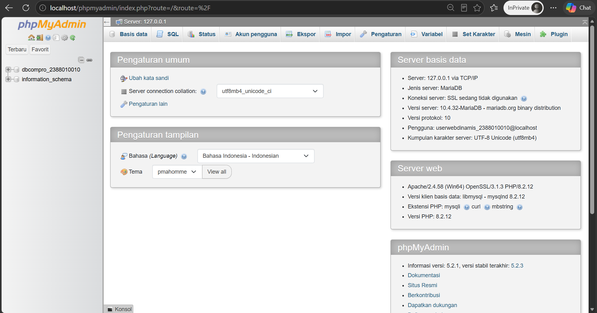
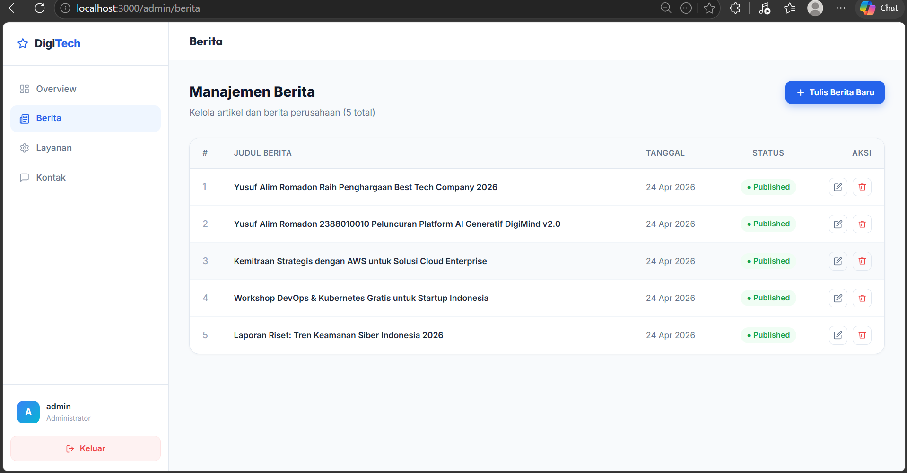
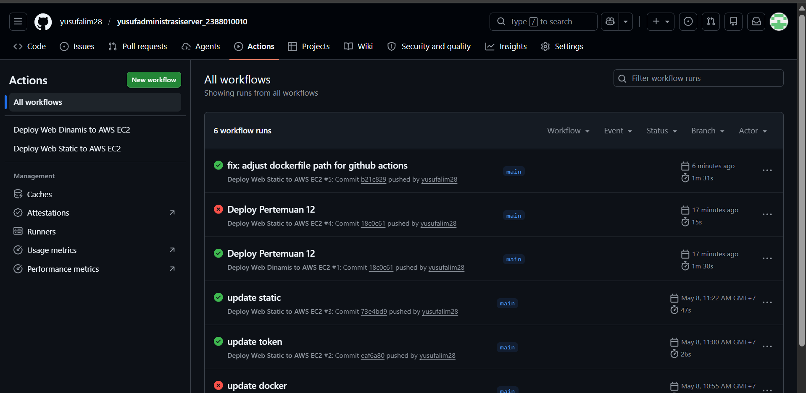
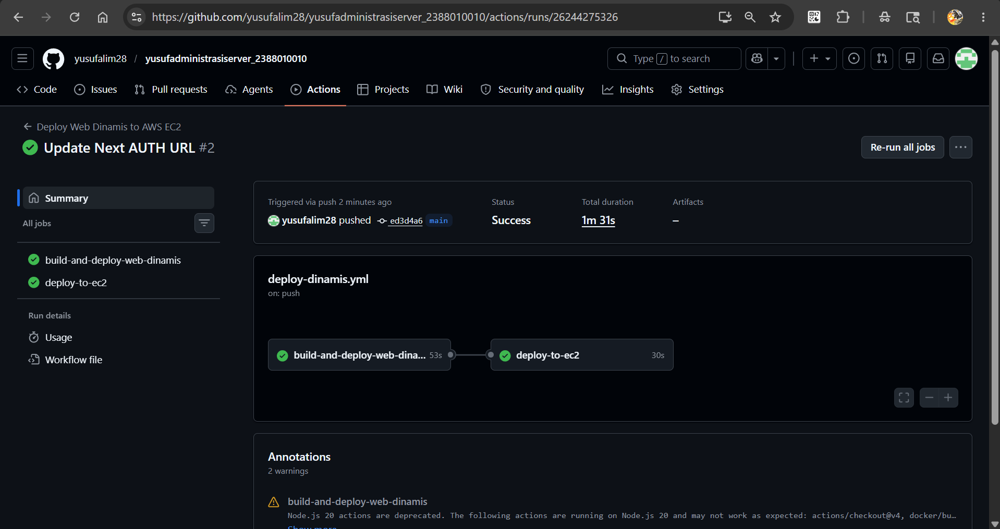
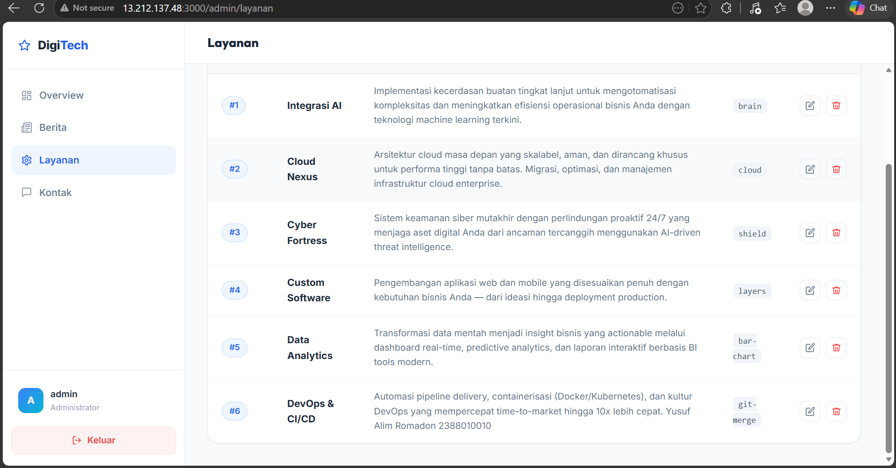

## Deploy Multiple Container menggunakan Docker Compose
1. Start Instance EC2 di AWS
2. Patching OS
3. Uninstall semua Services manual sebelumnya
4. Repositori baru untuk web dinamis di docker hub

5. Luka Projek Company himafor_nim
6. Bagi 2 Folder untuk projek Web App Statis dan Dinamis
7. Move file index dan Dcoker milik web statis ke Folder web-statis
8. Copy Folder Projek Next.JS (pertemuan9)ke folder web-dinamis
9. Lakukan Testing di Local Project Next.JS
      Install Dependencies: npm install
      Create user di DBMS : sudo mysql -u root -p
      CREATE USER 'userwebdinamis_2388010010'@'localhost' IDENTIFIED BY 'o4B@ohWqM]kYPHE-';
      GRANT ALL PRIVILEGES ON *.* TO 'userwebdinamis_2388010010'@'localhost';
      FLUSH PRIVILEGES;
      exit; 
      
      
      
      
      