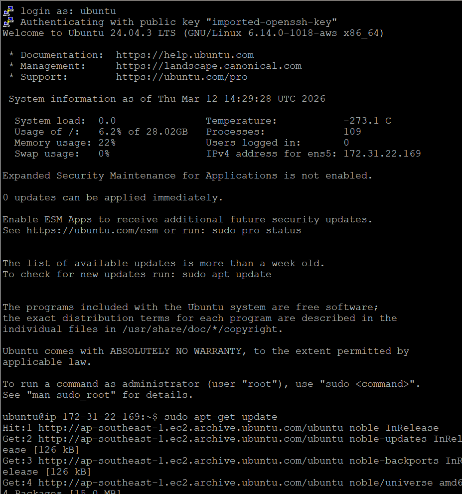
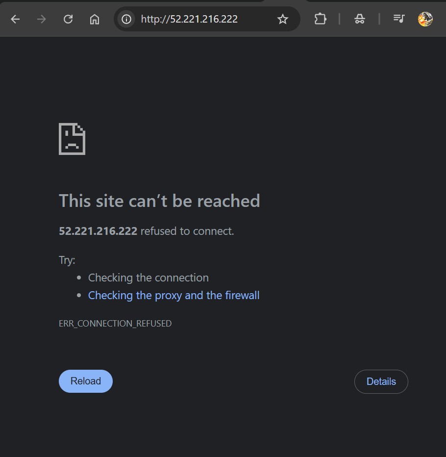
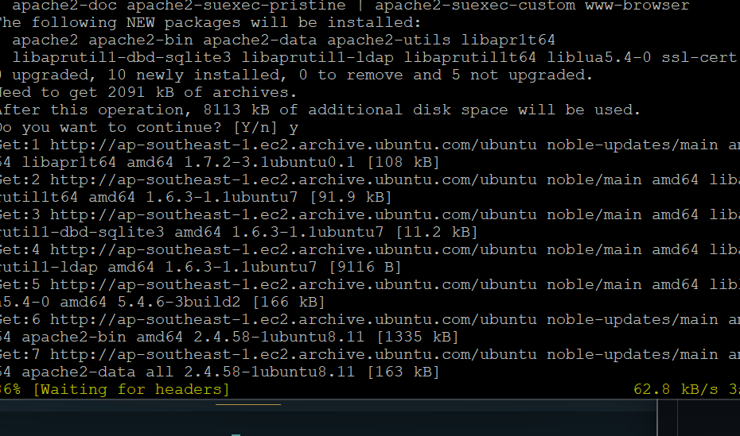
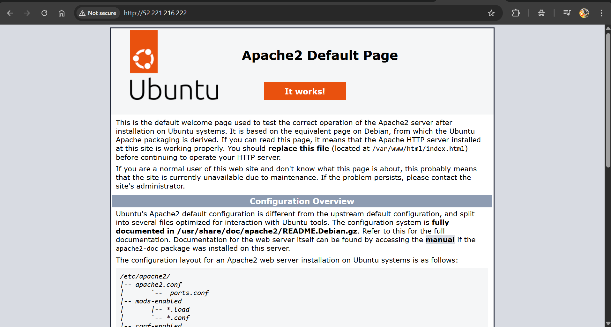
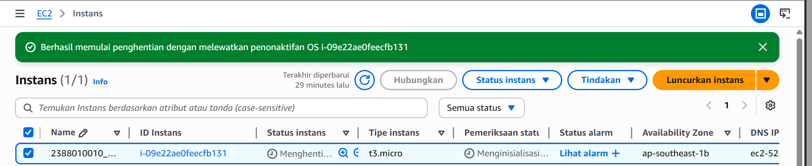

## Remote SSH
Instal Puty

'sudo apt-get update' > 'suda apt-get upgrade'

Pembuktian Remote SSH secara visual 
- Copy IP addres instance paste ke browser

Install Web Server seperti Apache/Nginx
sudo apt install apache2

Reload Browser

Matikan Instance
