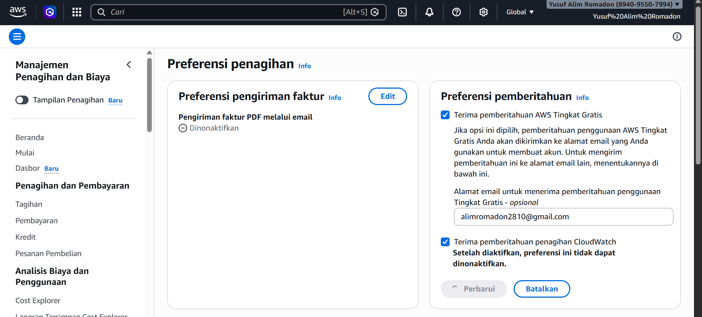
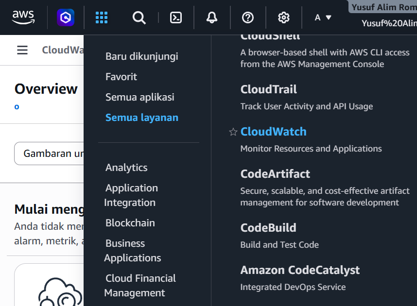
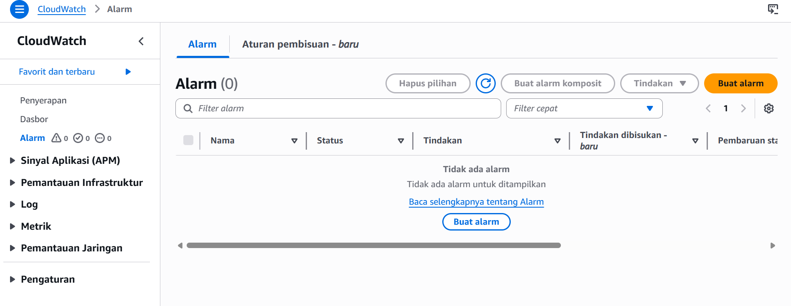
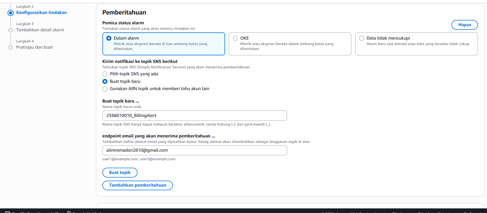
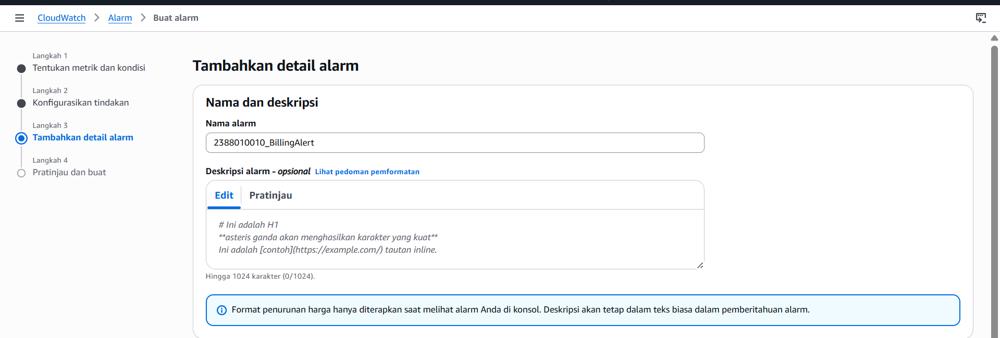
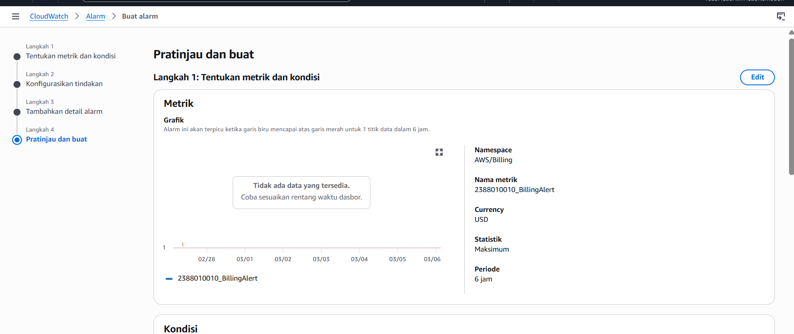
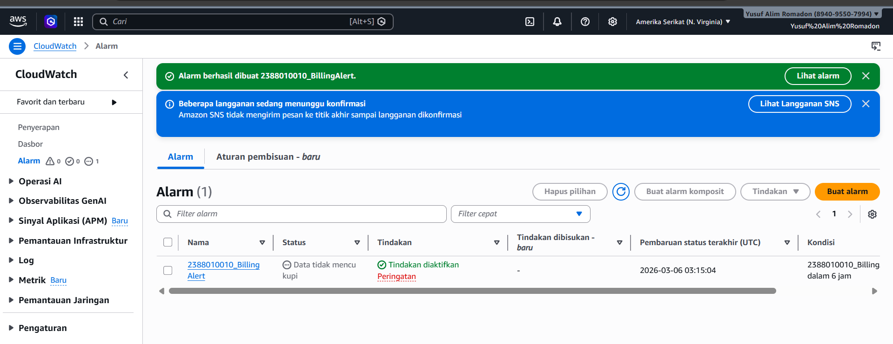

# membuat billing alert di aws untuk menghindari kelebihan alokasi dana
1. Menu dahsboard AWS kita pilih billing preference untuk mengaktifkan alert
- menu biling and cost management
- pilih menu billing preferences paling bawah
- pilih menu alert preference klik edit
- isi email ceklis receive
- klik Update

2. menu CLoudwath
- all service
- cloudWatch

3. Create Alarm

- Buat Alarm
- Pastikan region ada di US N Virginia
- klik Metric
- klik menu billing
- pilih total perkiraan Biaya
- ceklis Mata uang USD 
- Pilih Matrik 
- beri Nama metrik 
- scroll bawah pilih USD $

- next (konfigurasi)
- creat new topic => NIM_BillingAlert => Create
- Kirim Pemberitahuan ke ... (NIM_BillingAlert)

- next
- alarm name

- next

- buat alarm

- selesai

- Buka inbox/spam email dari AWS kemudian Klik Confirm.