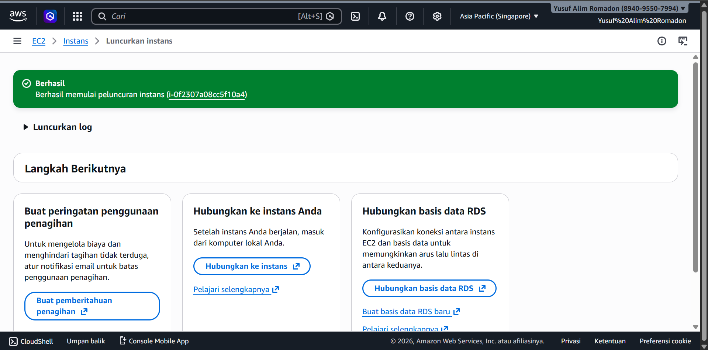
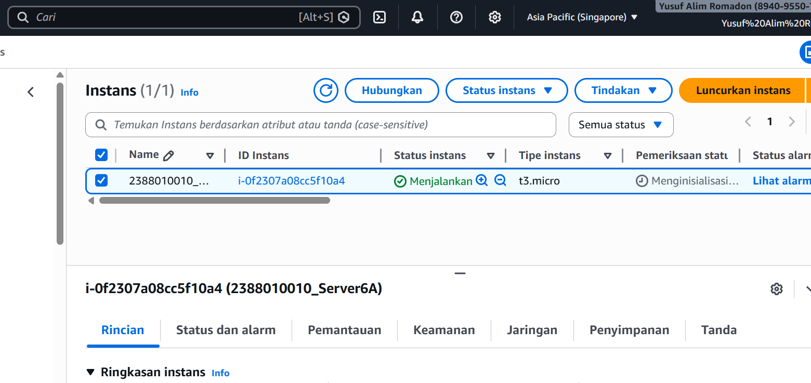

# Membuat instance di AWS EC2 dan AMI (Amazon Machine Image)
1. Search EC2
- Instans
- kembali lagi region ke region yng terdekat (jakarta/singapore)

2. Launch Instans
- isi nama instans (NIM_Server6A)
- OS Ubuntu
- type instans(t3.micro)

3. Membuat Key pair > Create New Key > isi nama > file. pem

4. Pengaturan Jaringan (Allow semua 3 box)
- Izinkan lalu lintas SSH dari
- Izinkan lalu lintas HTTPS dari internet
- Izinkan lalu lintas HTTP dari internet

5. configure Storage
- 1x30 gb

6. Luncurkan Instans
- berhasil

