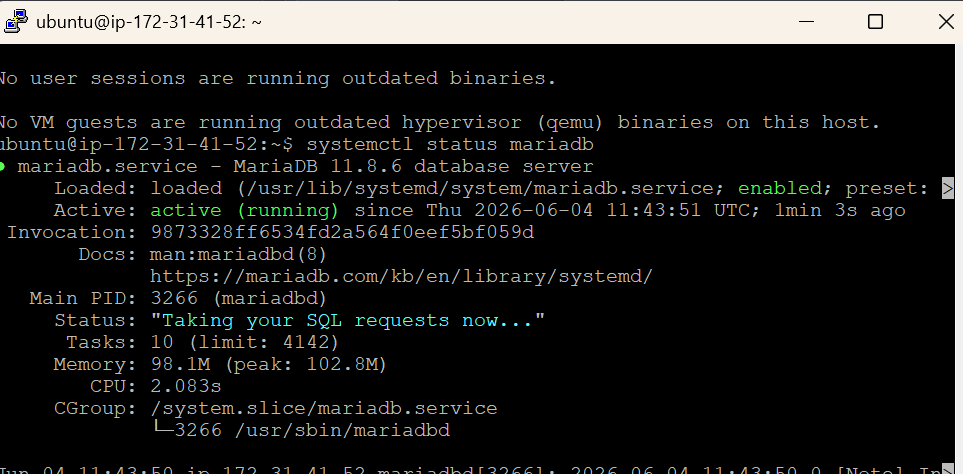
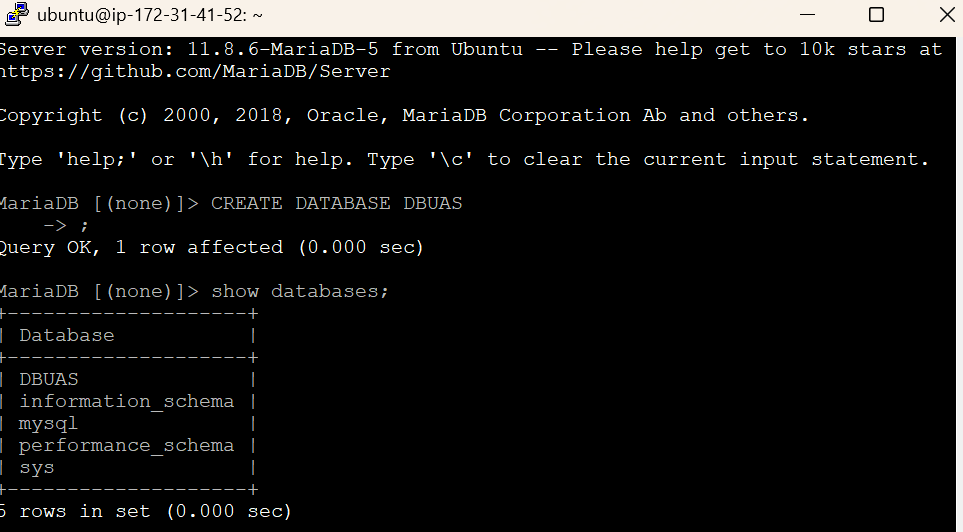
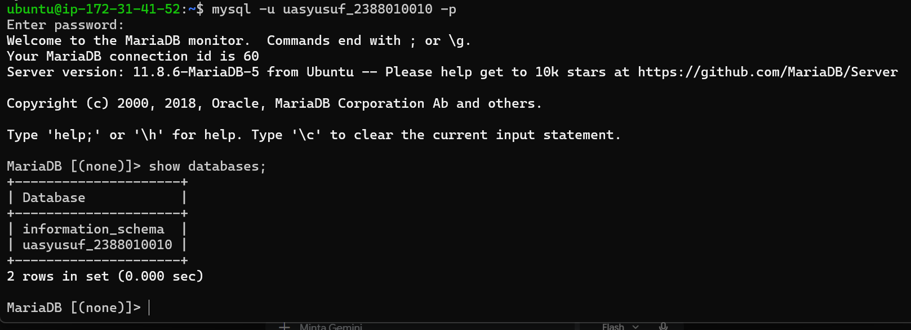

1. Aktifkan Instance AWs Ec2
2. Remote Instance Via Open SSH Powershell / putty
3. Patching OS (sudo apt-get update && sudo apt-get upgrade)
4. Install MariaDb (sudo apt install mariadb-server -y)
5. Cek Status MariaDb (systemctl status mariadb)

7. Hardening Database Server sudo mysql_secure_installation
  Change the password for the root user = Y
  Remove anonymous users = Y
  Disallow root login remotely = Y
  Remove test database and access to it = Y
  Reload privilege tables = Y
  <!-- ALTER USER 'root'@'localhost' IDENTIFIED VIA mysql_native_password USING PASSWORD('PasswordKamu'); -->
8. Create DB untuk Website Company Profile
  Login sebagai root -> bikin DB
  
9. CREATE USER 'uasyusuf_2388010010'@'localhost' IDENTIFIED BY 'PasswordKamu';
10. GRANT ALL PRIVILEGES ON uasyusuf_2388010010* TO 'uasyusuf_2388010010'@'localhost';
11. FLUSH PRIVILEGES;
12. exit; -> 
