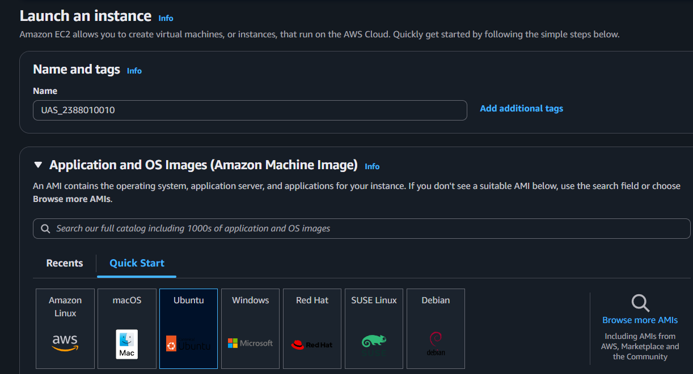
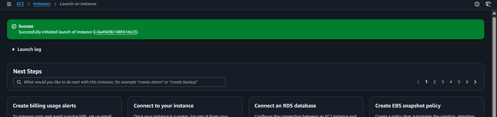

## Pembuatan EC2 untuk keperluan UAS
Buka Menu EC2 dari Dashboard
Klik Menu Launch Instance
Pastikan Region memilih terdekat
Isi Nama Instance -> UAS_2388010010
OS pilih Linux Ubuntu

Instance Type pilih T3.Micro
Membuat Key Pair -> Create new Key Pair -> Isi Nama -> file .Pem -> Create
Network Security
- Allow SSH Traffic
- Allow HTTPS
- Allow HTTP
Storage Setting -> 30Gb
Klik Launch Instance
Pastikan Alert Success
