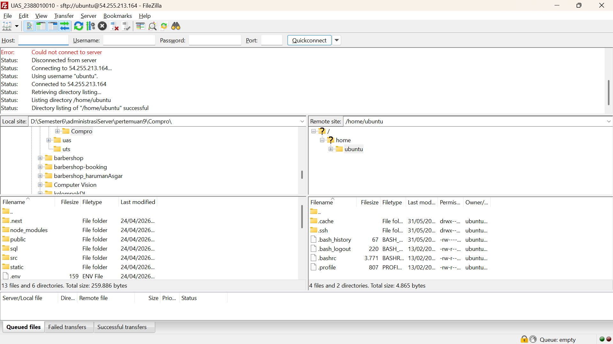
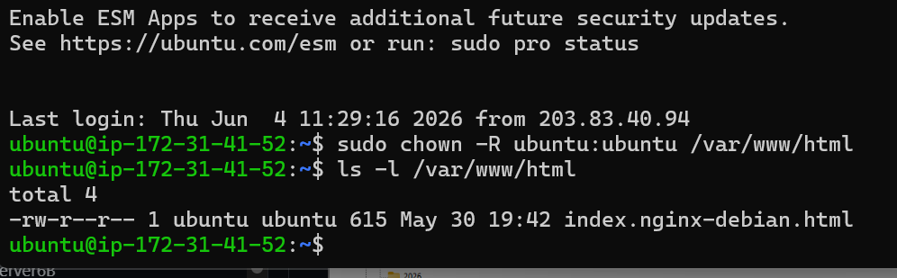

1. Running Instance EC2 di AWS (instance -> start Instance)
2. Buka FileZilla dan masukkan data berikut:
    Host: [IP_ADDRESS]
    Username: ubuntu
    Password: [PASSWORD]
    Port: 22
    Klik Connect

3. Remote SSH via PowerShell Windows
    masuk folder penyimpanan private key
    open with -> powershell
    masukan command (ssh -i nama file-Private-Key.pem ubuntu@[IP_ADDRESS])
4. Directori Folder Cloud arahakan ke Folder Web Services Area
    Keluar dari directori /home/ubuntu
    Masuk ke direktori /var/www/html
    buka file index.html dengan code editor
    akan gagal melakukan editing - Permission denied
    karena kita masuk user ubuntu tidak punya akses untuk write
5. Ubah Hak Akses Folder Web Services Area
    ke Terminal PowerShell
    masukan command (sudo chown -R ubuntu:ubuntu /var/www/html)
    cek kembali hak akses folder dengan command (ls -l /var/www/html)

