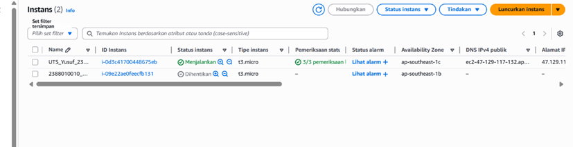
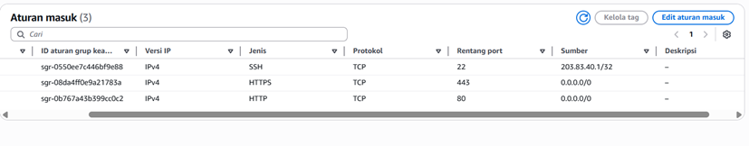
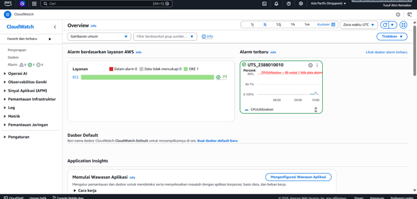
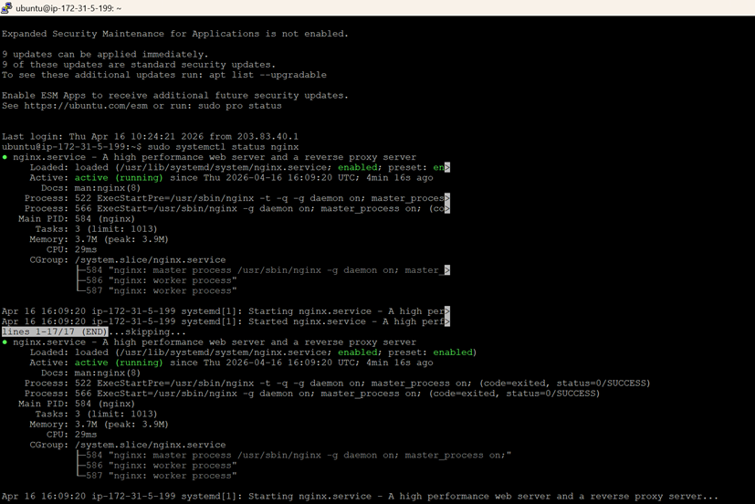
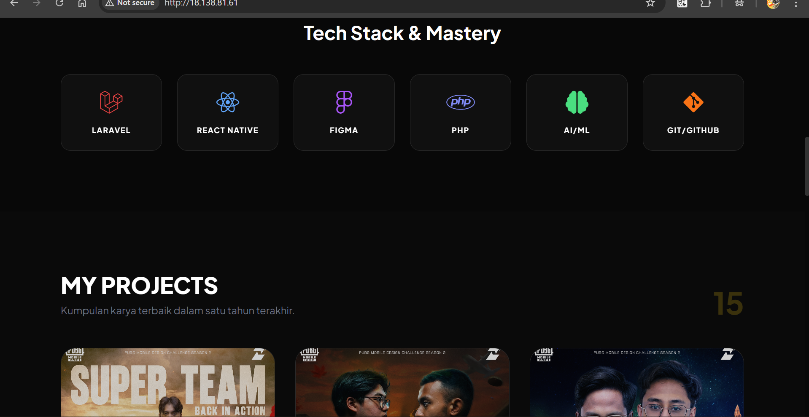

1. Buat instance EC2 sesuai spesifikasi di atas.
2. Buat Elastic IP (EIP) dan Attach (hubungkan) EIP tersebut ke instance EC2 Anda secara permanen.
3. Konfigurasi Security Group dengan ketat sesuai aturan di atas
  - Web Server: Menggunakan Nginx (Bukan Apache)
  
  
  - Monitoring: Wajib mengaktifkan Detailed CloudWatch Monitoring dan membuat 1 buah Alarm jika penggunaan CPU menyentuh >80%.
  
4. Konfigurasi Web Server
5. Gunakan aplikasi SFTP (seperti FileZilla atau WinSCP)

6. Pindahkan source code tersebut ke Document Root Nginx/Apache (biasanya di /var/www/html).

Screenshot halaman utama AWS EC2 Console (menunjukkan Instance ID, status Running, dan Elastic IP).

Screenshot halaman Security Group Inbound Rules (menunjukkan Port 22 hanya diakses oleh My IP).

Screenshot halaman CloudWatch Alarms (menunjukkan alarm CPU berstatus OK atau hijau).

Screenshot Terminal/PuTTY saat Anda berhasil mengeksekusi perintah sudo systemctl status nginx.

7. Tampilan nya

